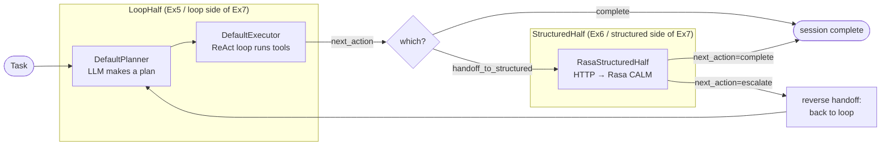
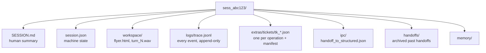
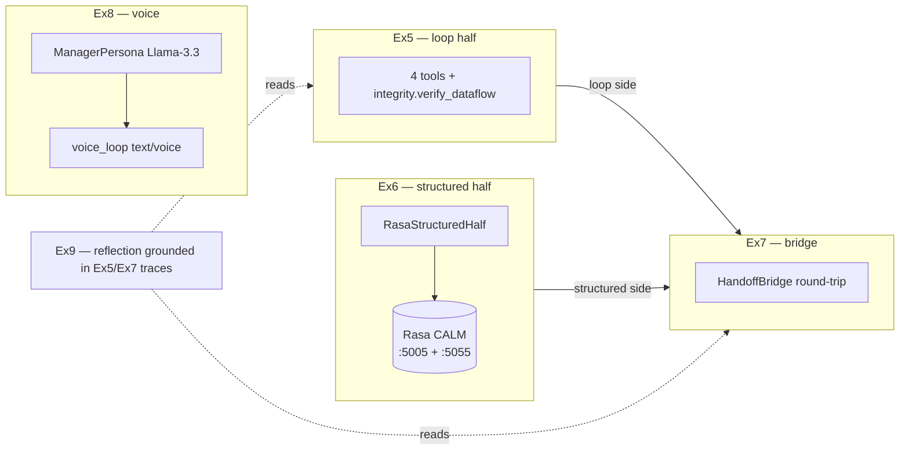

# Study guide — pub-booking agent, top to bottom

A reading-order walkthrough of the homework's reference solution and the
`sovereign-agent` architecture underneath it. Diagrams are Mermaid — they render
in VS Code's Markdown preview and on GitHub.

## Read in this order

1. **This file** — the framework: two halves, planner/executor, tools, sessions, IPC.
2. [ex5.md](ex5.md) — the **loop half**: 4 tools + the dataflow-integrity check.
3. [ex6.md](ex6.md) — the **structured half**: Rasa CALM over HTTP, three processes.
4. [ex7.md](ex7.md) — the **handoff bridge**: a loop ↔ structured round-trip state machine.
5. [ex8.md](ex8.md) — the **voice pipeline**: manager persona + STT/TTS.
6. [ex9.md](ex9.md) — the **reflection**: what to write and where the evidence lives.
7. [grading-and-discrepancies.md](grading-and-discrepancies.md) — how points are *actually* scored, and where the docs lie.

> Status note: in this checkout every exercise except Ex5 `tools.py` already
> ships implemented (an upstream solution leak — see the grading doc). Ex5
> `tools.py` was completed during this study pass; everything below describes
> the code as it now stands and is cited to `file:line`.

---

## The one big idea: two halves

A production agent is **not** "one LLM in a while-loop." This framework splits
work into two cooperating halves with opposite strengths:

| | **Loop half** | **Structured half** |
|---|---|---|
| Class | `LoopHalf` = `DefaultPlanner` + `DefaultExecutor` | `StructuredHalf` subclass |
| Job | open-ended **research / exploration** | **rule-following** confirmation |
| Driven by | an LLM thinking in a ReAct loop | deterministic rules / a dialog engine |
| Ex | Ex5 (research → flyer) | Ex6 (Rasa validates booking) |
| Fails by | spiralling, hallucinating | rejecting out-of-policy requests |

Both return the same envelope, a **`HalfResult`** (`sovereign_agent/halves`):

```
success: bool          # did this half achieve its goal?
output: dict           # structured result payload
summary: str           # one-line human summary
next_action: NextAction# "complete" | "handoff_to_structured" | "escalate" | ...
handoff_payload: dict | None
```

`next_action` is the steering signal everything above the half reads: the Ex7
bridge ([bridge.py:76-162](../../starter/handoff_bridge/bridge.py)) branches
entirely on it.



---

## Anatomy of the loop half

`LoopHalf(planner=DefaultPlanner(...), executor=DefaultExecutor(..., tools=...))`
— wired in [run.py:245-248](../../starter/edinburgh_research/run.py).

- **Planner** asks an LLM for a plan: a JSON list of *subgoals*, each with an
  `assigned_half` field ("loop" or "structured"). The offline plan is scripted
  in [run.py:39-58](../../starter/edinburgh_research/run.py). One **ticket**
  `planner.plan` is written for this step.
- **Executor** takes each subgoal and runs a **ReAct loop**: the LLM emits tool
  calls, the registry runs them, results feed back, repeat — until the LLM
  emits `complete_task` or `handoff_to_structured`. One ticket
  `executor.run_subgoal/<id>` per subgoal.
- Read-only tools marked `parallel_safe=True` may be **batched** in one turn
  (Ex5 calls `venue_search` + `get_weather` + `calculate_cost` together).

### Tools and the registry

`build_tool_registry(session)` ([tools.py:160-end](../../starter/edinburgh_research/tools.py))
starts from `make_builtin_registry(session)` and adds the four Ex5 tools.
Built-ins you always get: `read_file`, `write_file`, `list_files`,
`handoff_to_structured`, `complete_task`.

Each registered tool (`_RegisteredTool`) carries a `parameters_schema`,
`parallel_safe`, `error_codes`, and `examples`. A tool **function** returns a
`ToolResult(success, output, summary, error=None)`. On failure it returns
`success=False` with a `ToolError(code, message)` — or raises one, which the
registry's `execute()` catches and wraps (it intercepts any `SovereignError`).

---

## Sessions are directories (Decision 1)

Every run is a directory. There is no separate database, no hidden state — the
filesystem *is* the state. `Session` ([sovereign_agent/session/directory.py])
exposes these:



Accessors used by the homework: `session.workspace_dir`, `session.trace_path`,
`session.ipc_dir`, `session.ipc_input_dir`, `session.logs_dir`,
`session.tickets_dir`, `session.handoffs_audit_dir`,
`session.append_trace_event(...)`, `session.mark_complete/mark_failed/mark_escalated`.

Three primitives matter for debugging and for Ex9:

- **Ticket state machine** — each operation is a ticket with a state
  (`success` / `failed`) and a *manifest* of what it produced. `list_tickets`
  prints them ([run.py:254-257](../../starter/edinburgh_research/run.py)).
- **Trace** — `logs/trace.jsonl`, append-only, one JSON event per line. This is
  the source of truth `make narrate-latest` and the Ex7/Ex9 checks read.
- **Atomic IPC** — handoffs are written with `atomic_write_json` (write-temp +
  rename) so a reader never sees a half-written file.

---

## Crossing the boundary: handoff IPC

When the loop half wants the structured half, it does **not** call it directly —
it writes a file. `write_handoff(session, "structured", handoff)`
([handoff.py]) atomically drops `ipc/handoff_to_structured.json`. A `Handoff`
carries the full context across the process boundary:

```
from_half, to_half, written_at, session_id,
reason, context, data,            # data = the booking payload
return_instructions,              # "if you can't confirm, escalate with a reason"
constraints_reminder
```

The Ex7 bridge enforces a **fail-closed** rule: at most one handoff file visible
at a time. After a rejection it *archives* the forward file into `handoffs/`
before looping again ([bridge.py:147-151](../../starter/handoff_bridge/bridge.py)).

---

## LLM clients: fake vs real

Every scenario runs two ways, switched by a `--real` flag:

- **`FakeLLMClient`** — a scripted list of `ScriptedResponse`s (plan JSON, then
  tool calls, then final text). Deterministic, free, no keys. This is what
  `make ex5` / `make ex7` use and what the grader's behavioural checks run.
- **`OpenAICompatibleClient`** — points at Nebius Token Factory. `make ex5-real`
  etc. Models come from `.env`: planner `Qwen3-Next-80B-A3B-Thinking`, executor
  `Qwen3-32B`, manager persona `Llama-3.3-70B-Instruct`. Real models **spiral**
  and **hallucinate** — which is the curriculum (see `docs/real-mode-failures.md`).

---

## Where each exercise plugs in



Continue to [ex5.md](ex5.md).
