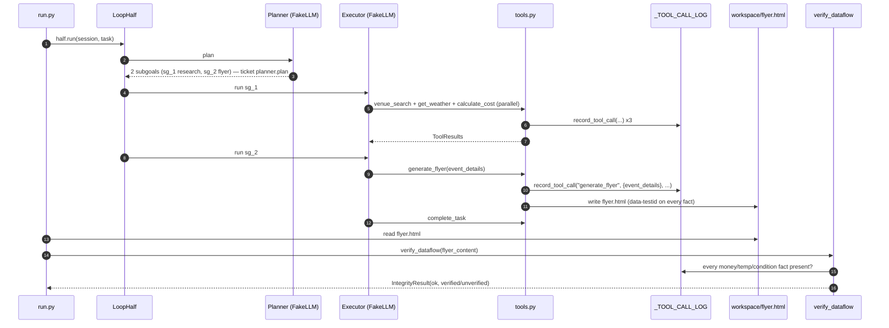
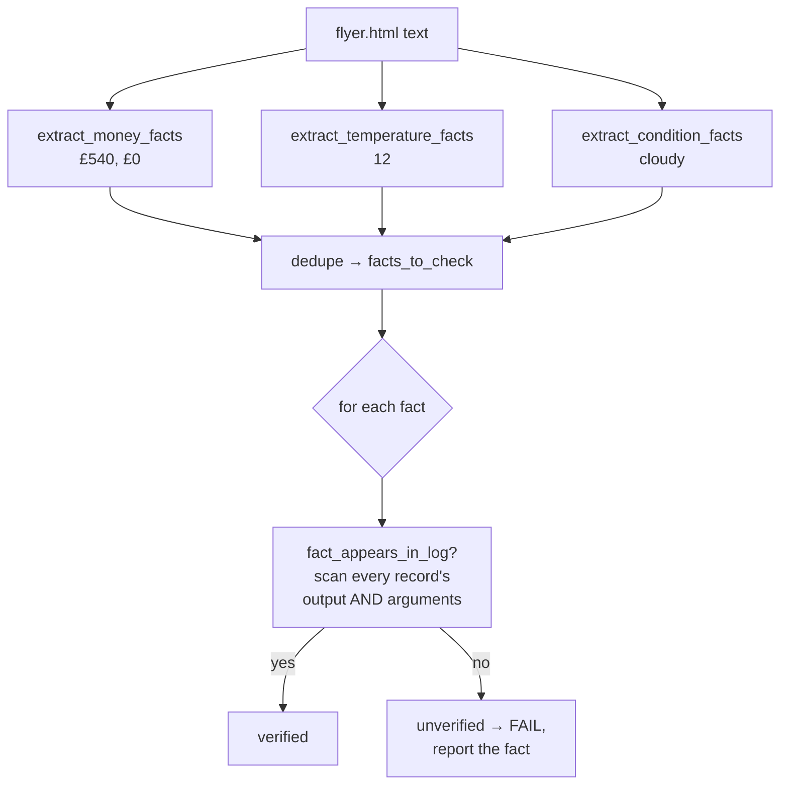

# Ex5 — Edinburgh research (the loop half)

**Goal:** a loop-half scenario that plans, runs four tools, writes an HTML
flyer, and proves with a *dataflow-integrity check* that no fact in the flyer
was invented by the LLM.

Files: [tools.py](../../starter/edinburgh_research/tools.py) ·
[integrity.py](../../starter/edinburgh_research/integrity.py) ·
[run.py](../../starter/edinburgh_research/run.py) ·
fixtures in [sample_data/](../../starter/edinburgh_research/sample_data/)

---

## End-to-end flow



Offline this is fully scripted by `_build_fake_client()`
([run.py:37-112](../../starter/edinburgh_research/run.py)); the four tools and
`complete_task` are emitted as `ToolCall`s in a fixed order. `make ex5` prints
the flyer and `✓ dataflow OK: verified 4 fact(s)`.

---

## The four tools ([tools.py](../../starter/edinburgh_research/tools.py))

Each tool reads its fixture, calls `record_tool_call(...)`, and returns a
`ToolResult`. A shared helper `_load_fixture()` raises
`ToolError("SA_TOOL_DEPENDENCY_MISSING", ...)` for an absent file — the registry
catches it and turns it into a failed `ToolResult` rather than a crash.

| Tool | Reads | Filters / computes | `parallel_safe` |
|---|---|---|---|
| `venue_search(near, party_size, budget_max_gbp)` | venues.json | `open_now` ∧ area substring ∧ seats ≥ party ∧ `hire_fee+min_spend ≤ budget` | **True** (read) |
| `get_weather(city, date)` | weather.json | exact city+date; miss → `success=False` + `SA_TOOL_INVALID_INPUT` (no raise) | **True** (read) |
| `calculate_cost(venue_id, party_size, duration_hours, catering_tier)` | catering.json + venues.json | formula below | **True** (pure) |
| `generate_flyer(session, event_details)` | — | writes `workspace/flyer.html` | **False** (writes) |

`parallel_safe=False` on `generate_flyer` is a graded fact
([test_ex5_scaffold.py:106-123](../../tests/public/test_ex5_scaffold.py)): a tool
that writes a file must never be batched concurrently.

### The cost formula — and a subtlety worth understanding

[tools.py:163-216](../../starter/edinburgh_research/tools.py) implements the
documented formula:

```
subtotal = base_rate[tier] * venue_modifier[venue] * party_size * max(1, hours)
service  = subtotal * service_charge_percent / 100
total    = subtotal + service + (venue.hire_fee_gbp + venue.min_spend_gbp)
deposit  = 0 if total<300 ; 20% if 300..1000 ; 30% if >1000   (deposit_policy)
```

For the scripted booking (`haymarket_tap`, party 6, 3h, `bar_snacks`):
`18 × 1.0 × 6 × 3 = 324`, `+10% = 356.4`, `+ (£0 + £200) = £556`, deposit `£111`.

**But the scripted flyer hard-codes `total_gbp: 540, deposit: 0`**
([run.py:79-95](../../starter/edinburgh_research/run.py)) — a "nice round"
demo number that does *not* equal the formula's £556. So why does
`verify_dataflow` still pass on the flyer?

Because **`generate_flyer` logs its own `event_details` into `_TOOL_CALL_LOG`**
([tools.py](../../starter/edinburgh_research/tools.py), the
`record_tool_call("generate_flyer", {"event_details": ed}, output)` line). The
flyer's £540/£0 trace back to *that* record. This is deliberate: the flyer is
verified against "facts some tool produced," and `generate_flyer` is the tool
that produced the flyer's facts. The threat model isn't "did the LLM round 556
to 540" — it's the next section.

---

## The dataflow-integrity check ([integrity.py](../../starter/edinburgh_research/integrity.py))



- **`_TOOL_CALL_LOG`** is a module-level `list[ToolCallRecord]`; `record_tool_call`
  appends `(tool_name, arguments, output)`; `clear_log()` resets it
  ([integrity.py:32-42](../../starter/edinburgh_research/integrity.py)). `run.py`
  clears it *after* the implemented-probe so probe calls don't pollute it
  ([run.py:194-196](../../starter/edinburgh_research/run.py)).
- **Extractors** strip HTML tags, then regex `£\d+`, `\d+°?C`, and known
  condition words ([integrity.py:64-83](../../starter/edinburgh_research/integrity.py)).
- **`fact_appears_in_log`** normalises (`strip("£°c ")`, lowercase) and
  recursively scans each record's `output` *and* `arguments`
  ([integrity.py:99-112](../../starter/edinburgh_research/integrity.py)).

### Why it catches a fabrication a human misses

The grader runs the scenario (log populated with real tool outputs *and*
`generate_flyer`'s event_details), then **mutates the flyer HTML** — `£540` → `£9999`
— and re-verifies. `9999` was never returned or passed to any tool, so it
appears in no record → the check fails with exactly `['£9999']`. A human skimming
a plausible-looking flyer would miss a wrong-but-plausible number; the check
can't, because it doesn't read the flyer for *plausibility*, it reads it for
*provenance*.

Verified in this checkout:

```
LEGIT flyer  -> ok=True  | dataflow OK: verified 4 fact(s) against tool outputs
PLANTED 9999 -> ok=False | dataflow FAIL: 1 unverified fact(s): ['£9999']
```

---

## How Ex5 is graded (authoritative — `grader/rubric.py`)

| Check | Pts | Status now |
|---|---|---|
| `ex5_scenario_runs_end_to_end` (`make ex5` exit 0, flyer written) | 6 | ✅ |
| `ex5_dataflow_catches_planted_fabrication` (£9999 flagged) | 6 | ✅ |
| `ex5_dataflow_accepts_legitimate_flyer` (clean flyer passes) | 3 | ✅ |
| Mechanical: every scenario has a real `verify_dataflow` (else −10) | — | ✅ present |
| ASSIGNMENT penalty: any tool missing a dataflow entry → −3 | — | avoided (all four record) |

`make ex5-real` (Nebius) is *not* graded for output correctness — it exists so
you watch `Qwen3-32B` occasionally spiral (5+ `venue_search` calls) and learn
the tool-cap defensive pattern.

Next: [ex6.md](ex6.md).
