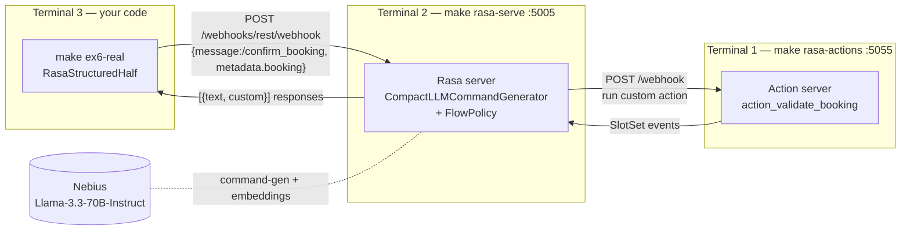
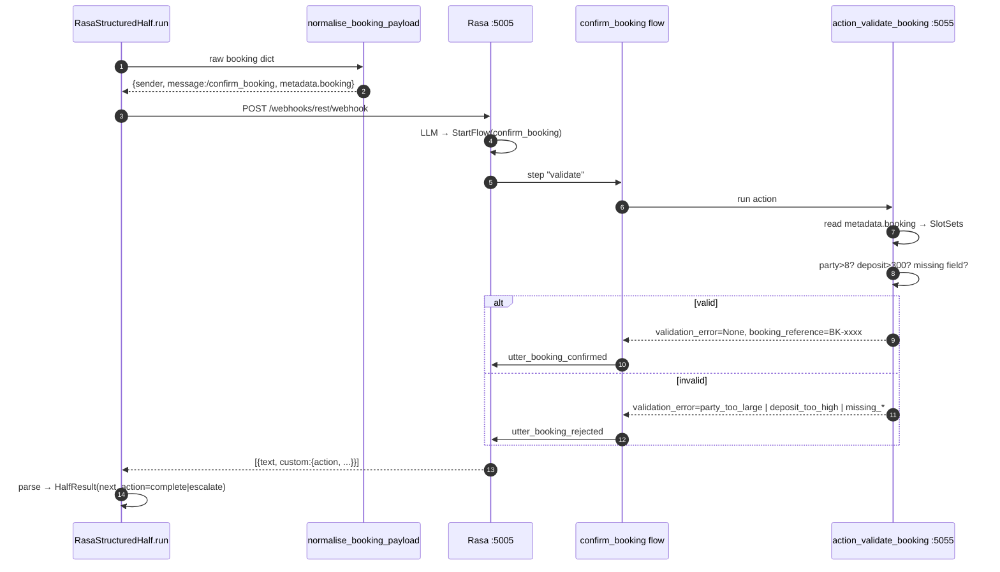
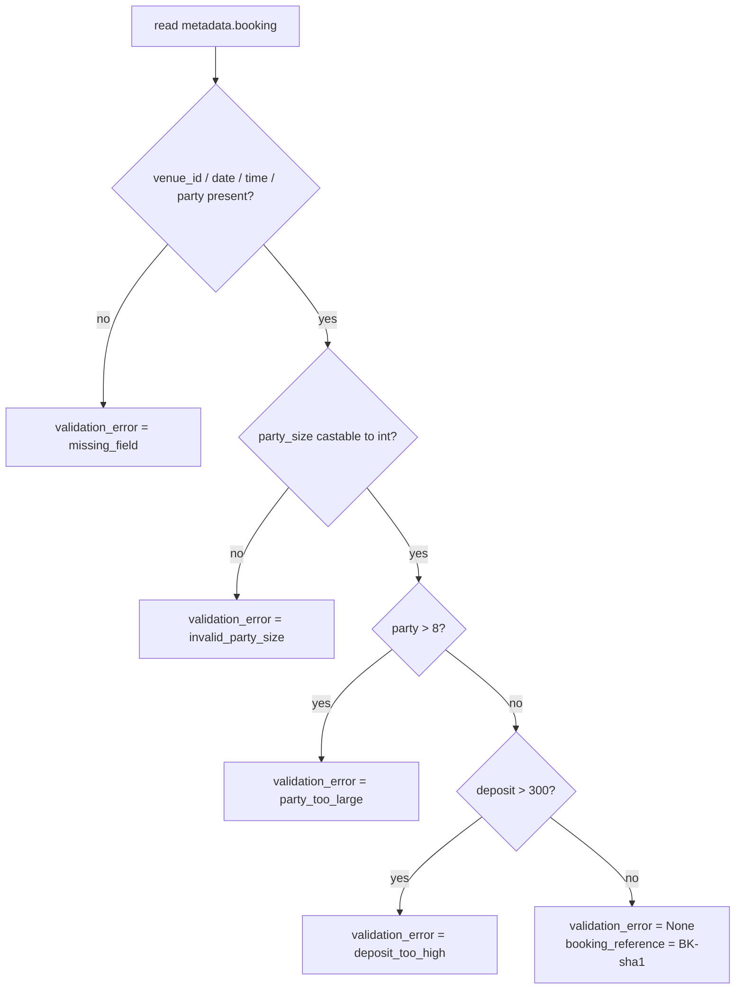

# Ex6 — Rasa CALM (the structured half)

**Goal:** replace an in-process stub with a *real dialog engine*. Your Python
POSTs a booking to Rasa over HTTP; Rasa runs a CALM flow + a custom action that
applies the policy rules (party ≤ 8, deposit ≤ £300) and answers confirm/reject.

Files: [structured_half.py](../../starter/rasa_half/structured_half.py) ·
[validator.py](../../starter/rasa_half/validator.py) ·
[run.py](../../starter/rasa_half/run.py) ·
[rasa_project/actions/actions.py](../../rasa_project/actions/actions.py) ·
[rasa_project/data/flows.yml](../../rasa_project/data/flows.yml) ·
[domain.yml](../../rasa_project/domain.yml) · [config.yml](../../rasa_project/config.yml) · [endpoints.yml](../../rasa_project/endpoints.yml)

---

## Three processes (this is what trips students up)

Rasa lives *outside* your Python. Two Rasa processes + your scenario = three
terminals.

- **Terminal 2** (`rasa-serve`) hosts the dialog manager. Its
  `CompactLLMCommandGenerator` uses a Nebius **instruct** model (configured in
  [endpoints.yml:39-48](../../rasa_project/endpoints.yml)) to turn the incoming
  `/confirm_booking` message into a `StartFlow(confirm_booking)` command.
  ⚠️ **Must be an instruct model** — a *thinking* model emits `<think>` tags that
  break Rasa's command parser ([endpoints.yml:20-37](../../rasa_project/endpoints.yml)).
- **Terminal 1** (`rasa-actions`) hosts custom Python actions. Rasa POSTs to it.
  After **any** edit to `actions.py` you must restart this — Rasa caches the
  module in memory.
- **Terminal 3** is your scenario.

**The lesson:** real agent systems are multi-process and talk over HTTP. The
`make ex6-auto` tier hides this by auto-spawning everything
([RasaHostLifecycle](../../starter/rasa_half/structured_half.py)); convenient,
but it's the thing tier-2 is trying to teach.

### Don't have a Rasa Pro license? The mock.

`spawn_mock_rasa()` ([structured_half.py:487-492](../../starter/rasa_half/structured_half.py))
starts a stdlib `ThreadingHTTPServer` whose `_MockRasaHandler`
([structured_half.py:424-484](../../starter/rasa_half/structured_half.py))
returns the **same response shape with the same party/deposit rules** as the
real `ActionValidateBooking`. `make ex6` (tier 1) uses it — your
`normalise_booking_payload` + `RasaStructuredHalf.run` HTTP wiring is exercised
end-to-end without a license. You lose only the points that grade against real
CALM flows.

---

## The request → flow → action → response cycle

### Why `metadata`, not slots?

The CALM command generator turns `/confirm_booking` into `StartFlow` but does
**not** copy `metadata` into slots — so `action_validate_booking` reads
`tracker.latest_message.metadata.booking` itself, *then* `SlotSet`s each value so
the response templates can interpolate `{booking_reference}` etc. This is the
crux of [actions.py:33-95](../../rasa_project/actions/actions.py).

### `ActionValidateBooking` decision tree ([actions.py:97-136](../../rasa_project/actions/actions.py))

`MAX_PARTY_SIZE_FOR_AUTO_BOOKING = 8`, `MAX_DEPOSIT_FOR_AUTO_BOOKING_GBP = 300`
([actions.py:29-30](../../rasa_project/actions/actions.py)). The flow
([flows.yml:35-52](../../rasa_project/data/flows.yml)) branches on
`slots.validation_error is not null` → `rejected` else `confirmed`.

---

## The validator ([validator.py](../../starter/rasa_half/validator.py))

`normalise_booking_payload(raw)` turns loose loop-half data into Rasa's exact
message shape, normalising **5** fields (grader needs ≥3):

| Field | Example in → out | Helper |
|---|---|---|
| date | `"25th April 2026"` → `"2026-04-25"` | `_normalise_date` (handles today/tomorrow, month names) |
| currency | `"£200"` / `"200 GBP"` → `200` | `parse_currency_gbp` |
| party_size | `"6 people"` → `6` (reject < 1) | `parse_party_size` |
| time | `"7:30pm"` → `"19:30"`; `"noon"` → `"12:00"` | `parse_time_24h` |
| venue_id | `"Haymarket Tap"` → `"haymarket_tap"` | `canonicalise_venue_id` |

A `ValidationFailed` on un-saveable input is caught by
`RasaStructuredHalf.run` and returned as `next_action=escalate`
([structured_half.py:85-93](../../starter/rasa_half/structured_half.py)) — never a
crash. The sender id is a stable sha1 of venue+date+time so retries land on the
same Rasa conversation.

---

## How `RasaStructuredHalf.run` reads the answer ([structured_half.py:75-213](../../starter/rasa_half/structured_half.py))

It POSTs, then scans the returned messages for signals:

- `custom.action == "committed"` or text contains "booking confirmed" → **confirmed**
  → `HalfResult(success=True, next_action="complete")` with the `booking_reference`.
- `custom.action == "rejected"` or text contains "rejected"/"can't accept" →
  **rejected** → `HalfResult(success=False, next_action="escalate")` with the reason.
- Network failures map to `SA_EXT_SERVICE_UNAVAILABLE` / `SA_EXT_TIMEOUT` and also
  `escalate` — the bridge upstream decides what to do.

That `escalate` is exactly what Ex7's bridge turns into a reverse handoff.

---

## How Ex6 is graded (authoritative — `grader/rubric.py`)

| Check | Pts |
|---|---|
| `ex6_structured_half_accepts_valid_booking` (party 6, £200 → approved) | 4 |
| `ex6_rejects_oversize_party` (party 12 → rejected w/ reason) | 3 |
| `ex6_rejects_high_deposit` (£500 → rejected w/ reason) | 3 |

The local grader runs `make ex6` (mock tier) which exercises all three against
the stdlib mock. Real-CALM points (extra in CI) need the license. The
`make ex6` runner uses a sample booking of party 6 / `£200` that the mock
**confirms** ([run.py:48-57](../../starter/rasa_half/run.py)).

> Note the drift: ASSIGNMENT.md still asks for `resume_from_loop` and
> `request_research` flows. They were **removed on purpose** — see the comment
> in [flows.yml:20-33](../../rasa_project/data/flows.yml) and
> [grading-and-discrepancies.md](grading-and-discrepancies.md). The reverse path
> lives in Ex7's Python bridge, not in Rasa.

Next: [ex7.md](ex7.md).
