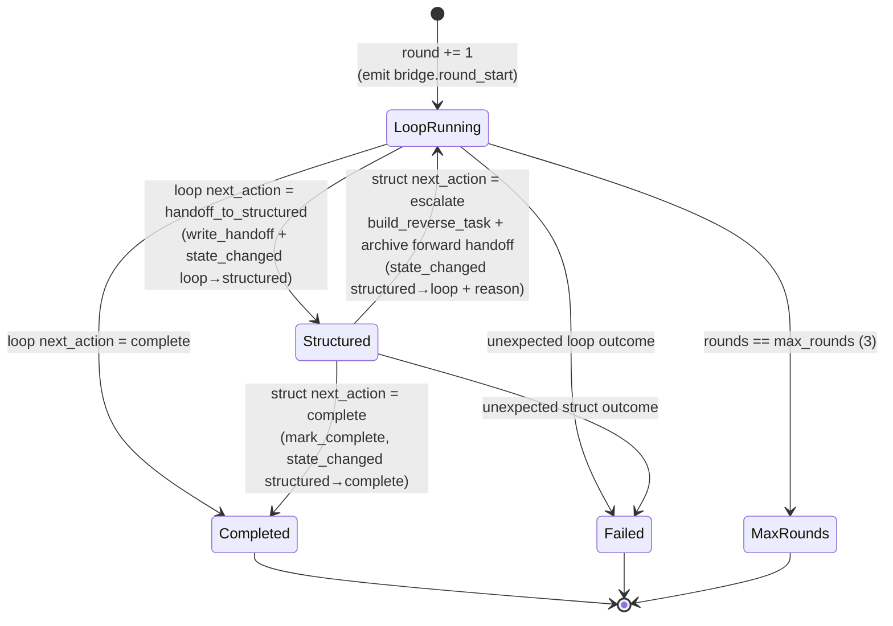
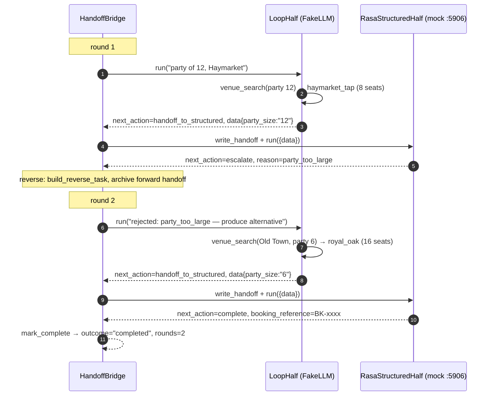
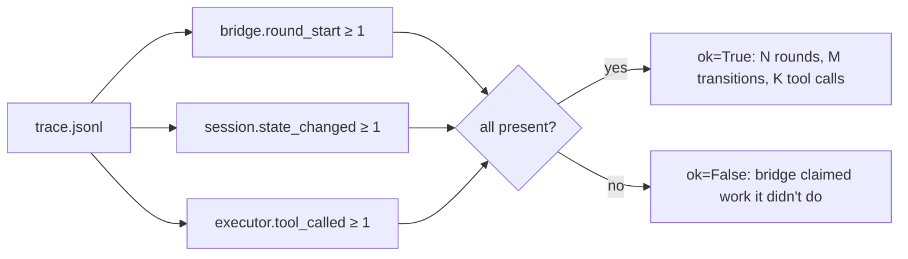

# Ex7 — the handoff bridge (round-trip state machine)

**Goal:** wire a **bidirectional** round-trip. The loop half proposes; the
structured half (Ex6's Rasa) confirms or rejects; on rejection the bridge sends
control *back* to the loop with the reason, and tries again. Loop → structured →
loop → structured → completion, capped at 3 rounds.

Files: [bridge.py](../../starter/handoff_bridge/bridge.py) ·
[run.py](../../starter/handoff_bridge/run.py) ·
[integrity.py](../../starter/handoff_bridge/integrity.py)

The bridge is **not** a `Half`. It sits one level above the halves and decides
which runs next — the piece the base framework can't do, because `LoopHalf` only
knows how to request a handoff *forward*.

---

## The state machine ([bridge.py:56-171](../../starter/handoff_bridge/bridge.py))



Each box transition emits a `session.state_changed` trace event with `from`/`to`
and (on a reject) the `rejection_reason`. Those events are what Ex9 Q1 quotes and
what the integrity check counts.

---

## The scripted two-round demo ([run.py](../../starter/handoff_bridge/run.py))



The `FakeLLMClient` scripts both rounds as two plan/search/handoff triples
([run.py:27-121](../../starter/handoff_bridge/run.py)). Round 1 hands off party
`"12"` (mock rejects, `party_too_large`); round 2 scales to party `6` at
`royal_oak` (mock confirms). `make ex7` exits 0 with `outcome=completed,
rounds=2`.

---

## Two things the grader specifically checks

### 1. Fail-closed: one handoff file at a time ([bridge.py:147-152](../../starter/handoff_bridge/bridge.py))

After a reject, before looping, the bridge **renames** the forward handoff out
of `ipc/` into `handoffs/round_N_forward.json`:

```python
forward_file = session.ipc_input_dir / "handoff_to_structured.json"
if forward_file.exists():
    forward_file.rename(session.handoffs_audit_dir / f"round_{rounds}_forward.json")
```

So at no instant are two live handoff files visible in `ipc/`. (`grader:
ex7_no_multiple_handoff_files`, 2 pts.) This is the IPC discipline that prevents
a stale handoff from being re-consumed.

### 2. The bridge's own integrity check ([integrity.py:24-57](../../starter/handoff_bridge/integrity.py))

`verify_dataflow(session)` audits `trace.jsonl` — *not* a flyer this time — and
fails unless all three are present:



This catches a bridge that reports `completed` without doing anything (e.g. the
loop returned a fake `complete` on turn 0). The **grader plants** a
"structured half always rejects" failure; a correct bridge surfaces it as
`max_rounds_exceeded` after exhausting 3 rounds rather than hanging or
falsely completing.

---

## Forward vs reverse payloads

- **Forward** — `build_forward_handoff` ([bridge.py:177-192](../../starter/handoff_bridge/bridge.py))
  packs the loop result into a `Handoff(from_half="loop", to_half="structured",
  data=..., return_instructions="if you can't confirm, escalate with a reason")`.
- **Reverse** — `build_reverse_task` ([bridge.py:195-208](../../starter/handoff_bridge/bridge.py))
  builds the next loop input with the rejection reason baked into the task text
  and a `context.retry=True` flag, so the loop knows to propose something else.

---

## How Ex7 is graded (authoritative — `grader/rubric.py`)

| Check | Pts |
|---|---|
| `ex7_round_trip_completes` (reject → re-research → approval) | 6 |
| `ex7_no_multiple_handoff_files` (≤ 1 handoff file at a time) | 2 |

`make ex7-real` puts a live Nebius LLM in the loop — it can spiral exactly like
Ex5; that's expected. `make narrate-latest` renders the state transitions in
English.

Next: [ex8.md](ex8.md).
