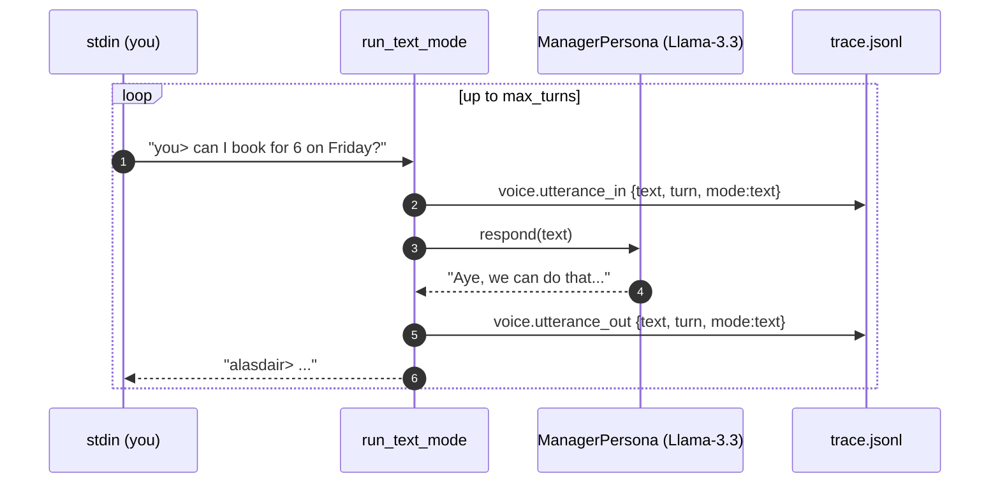
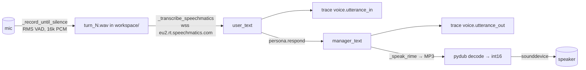
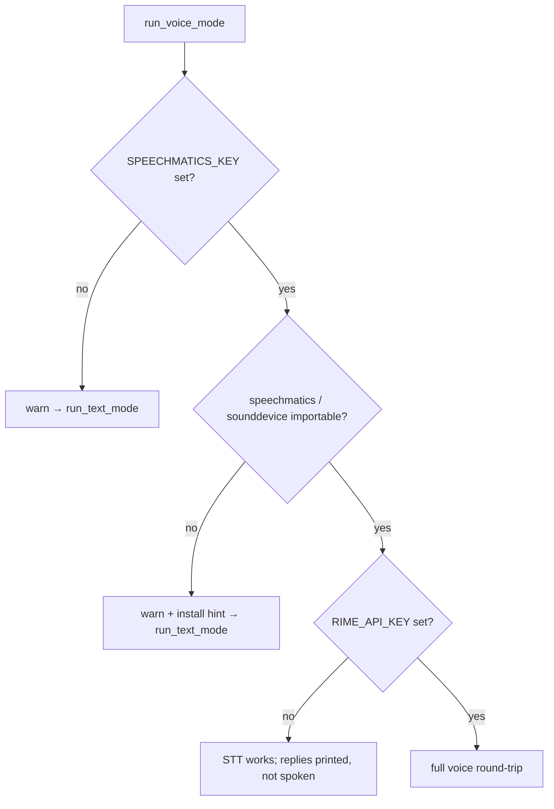

# Ex8 — the voice pipeline

**Goal:** talk to the pub manager. A Llama-3.3-70B persona ("Alasdair MacLeod")
holds a conversation and accepts/declines under the same rules. Two modes —
**text** (free, the primary graded path) and **voice** (Speechmatics STT + Rime
Arcana TTS) — that emit *identical* trace events.

Files: [manager_persona.py](../../starter/voice_pipeline/manager_persona.py) ·
[voice_loop.py](../../starter/voice_pipeline/voice_loop.py) ·
[run.py](../../starter/voice_pipeline/run.py)

---

## The persona ([manager_persona.py](../../starter/voice_pipeline/manager_persona.py))

`ManagerPersona` wraps an `OpenAICompatibleClient` (Nebius) at
`meta-llama/Llama-3.3-70B-Instruct`, `temperature=0.0`. The system prompt
([manager_persona.py:22-41](../../starter/voice_pipeline/manager_persona.py))
fixes the character *and* the rules:

- party ≤ 8 → accept (unless deposit > £300); party ≥ 9 → decline, suggest a
  bigger venue; deposit > £300 → decline (needs head office).

`respond(utterance)` builds `[system] + full history + [user]` and appends the
reply to `history` ([manager_persona.py:70-96](../../starter/voice_pipeline/manager_persona.py)),
so the manager remembers earlier turns (the party size you mentioned, the deposit
you offered). History is kept whole — fine for short chats; the `TODO` notes
where you'd add a sliding window.

> The rules in the prompt are graded by an **LLM-as-judge** (a *different* model
> than you ran) for "stays in character + follows rules." Edit the accent/name
> freely; keep the rules.

---

## Text mode — read this first ([voice_loop.py:41-77](../../starter/voice_pipeline/voice_loop.py))

The trace events are the contract: `voice.utterance_in` (actor `user`) and
`voice.utterance_out` (actor `manager`). Voice mode emits the *exact same shapes*
with `mode:"voice"` — so grading never depends on which mode ran.

---

## Voice mode ([voice_loop.py:83-210](../../starter/voice_pipeline/voice_loop.py))

- **Capture** — `_record_until_silence` ([voice_loop.py:216-279](../../starter/voice_pipeline/voice_loop.py))
  reads 100 ms chunks, computes RMS, ends a turn after `SILENCE_TIMEOUT_S` (2 s)
  of silence or `MAX_UTTERANCE_S` (15 s). Saves the WAV to `workspace/` for
  debugging.
- **STT** — `_transcribe_speechmatics` ([voice_loop.py:285-335](../../starter/voice_pipeline/voice_loop.py))
  pushes PCM over a websocket and collects final transcripts (`pcm_s16le`, 16 kHz).
- **TTS** — `_speak_rime` ([voice_loop.py:341-386](../../starter/voice_pipeline/voice_loop.py))
  POSTs to `users.rime.ai/v1/rime-tts` (`modelId: arcana`, speaker `luna`), gets
  MP3, decodes via `pydub`, plays via `sounddevice`.

### Graceful degradation (a graded behaviour)

No key, no dep, no mic — it never crashes; it falls back with a visible warning
([voice_loop.py:87-125](../../starter/voice_pipeline/voice_loop.py)). `run.py`
still requires `NEBIUS_KEY` (the persona needs an LLM) and exits cleanly if it's
missing ([run.py:28-31](../../starter/voice_pipeline/run.py)).

---

## How Ex8 is graded (authoritative — `grader/rubric.py`)

| Check | Pts |
|---|---|
| `ex8_text_mode_at_least_3_turns` (conversation reaches ≥ 3 turns) | 4 |
| `ex8_trace_has_utterance_events` (both `voice.utterance_in` and `_out` present) | 3 |
| (Real voice end-to-end + persona-in-character — extra, in CI / with keys) | — |

Local grader only checks that `run_voice_mode` isn't a stub
([grader/check_submit.py:304-326](../../grader/check_submit.py)). **Text mode
is the primary path** — you can score most of Ex8 with `NEBIUS_KEY` alone via
`make ex8-text`. Voice (`make ex8-voice`) needs `SPEECHMATICS_KEY` +
`RIME_API_KEY` + a mic and is a bonus.

> Drift: ASSIGNMENT.md §Ex8 says **ElevenLabs** for TTS; the code uses **Rime**
> ([voice_loop.py:341-362](../../starter/voice_pipeline/voice_loop.py)). Follow
> the code. See [grading-and-discrepancies.md](grading-and-discrepancies.md).

Next: [ex9.md](ex9.md).
