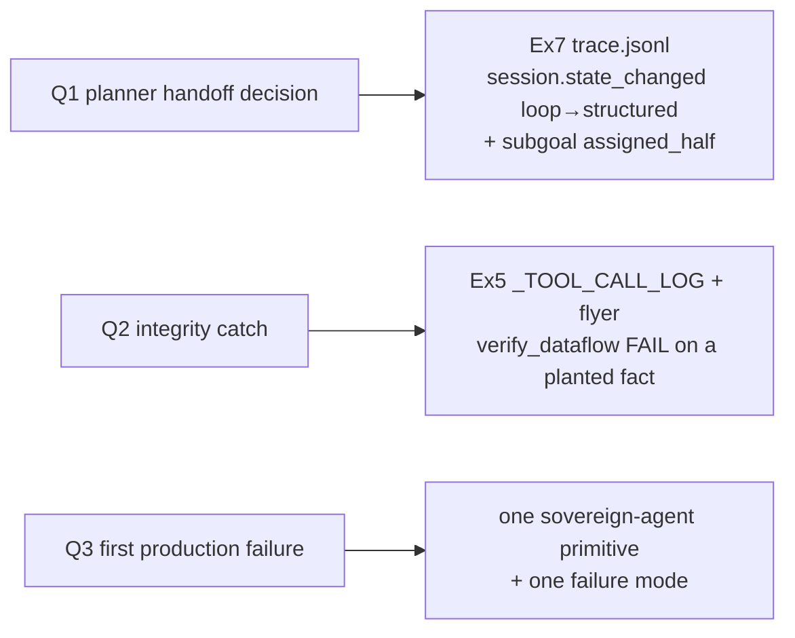

# Ex9 — the reflection (30 pts, LLM-judged)

Three short written answers, each **grounded in YOUR OWN session logs**. This is
the entire Reasoning layer (30/100), scored in CI by an LLM-as-judge running a
*different* model than you used, which cross-checks your citations against trace
artifacts in your repo.

File: [answers/ex9_reflection.md](../../answers/ex9_reflection.md)

> ⚠️ **This file currently ships pre-filled with example answers** citing
> invented session IDs (`sess_a382a2149fc1`, `sess_de44a1b8eb12`). The rules say
> copy-pasted examples score **zero**. These must be **deleted and rewritten**
> from real runs on your machine. See
> [grading-and-discrepancies.md](grading-and-discrepancies.md).

---

## The three questions and where the evidence lives

- **Q1 — what made the planner hand off?** Run `make ex7`, then open the session's
  `logs/trace.jsonl`. Quote the real `session.state_changed` event with
  `from:loop, to:structured` (the bridge emits it at
  [bridge.py:105-111](../../starter/handoff_bridge/bridge.py)) and/or a subgoal's
  `assigned_half`. Name the *signal* (e.g. loop `next_action=handoff_to_structured`
  after the venue search). Cite the `sess_…` id and the line.
- **Q2 — a fabrication the check caught that a human would miss.** Use your Ex5
  run: a *plausible* wrong number (e.g. `£560` deposit that follows the formula
  shape but no tool produced) that `verify_dataflow` flags as unverified while a
  skim-reader accepts it. Be specific enough that someone else could reconstruct
  the test (which value, which tool log, why it fails). The mechanism is in
  [ex5.md](ex5.md).
- **Q3 — first production failure + ONE primitive that surfaces it.** Pick
  exactly one primitive (ticket state machine, manifest discipline, IPC atomic
  rename, SessionQueue retry, …) and exactly one failure mode. E.g. "Rasa
  timeout under load → `RasaStructuredHalf` returns `SA_EXT_TIMEOUT`/escalate →
  the **ticket state machine** records a `failed` ticket so the run is auditable
  rather than silently wrong."

---

## Grading shape (from ASSIGNMENT.md §Ex9 — CI only)

| Dimension | Pts |
|---|---|
| Each answer cites specific ticket IDs / trace lines from your own sessions | 9 (3×3) |
| Each answer is 100–400 words | 3 (1×3) |
| Grounded in reality (not generic LLM waffle) | 6 (2×3) |
| Q3 names exactly ONE primitive and ONE failure mode | 2 |

Locally, `make check-submit` only verifies the file exists and is non-empty
([grader/check_submit.py:147-182](../../grader/check_submit.py)) — it can't score
reasoning. `make ex9` runs that single check.

---

## The citation tension (resolve before submitting)

The judge cross-checks against **`sessions/` committed to your repo**
([answers/README.md:11](../../answers/README.md)), but `sessions/` is
**git-ignored** ([.gitignore:9](../../.gitignore)) and the runners persist
real-mode sessions to the OS data dir, not `./sessions/`. To make citations
verifiable you will need to **copy the cited session dirs under `./sessions/`
and force-add them** (`git add -f sessions/sess_…`) so they land in the commit
the grader checks out. Plan for this when you do the Ex9 pass.

Practical sequence when you reach Ex9:
1. `make ex7` (and `make ex5`) to generate real sessions; note the `sess_…` ids.
2. `make narrate SESSION=sess_…` to read them in English; find the exact lines.
3. Rewrite all three answers (delete the shipped examples first).
4. Copy those session dirs into `./sessions/` and `git add -f` them.

Back to the [index](README.md) · grading map: [grading-and-discrepancies.md](grading-and-discrepancies.md).
