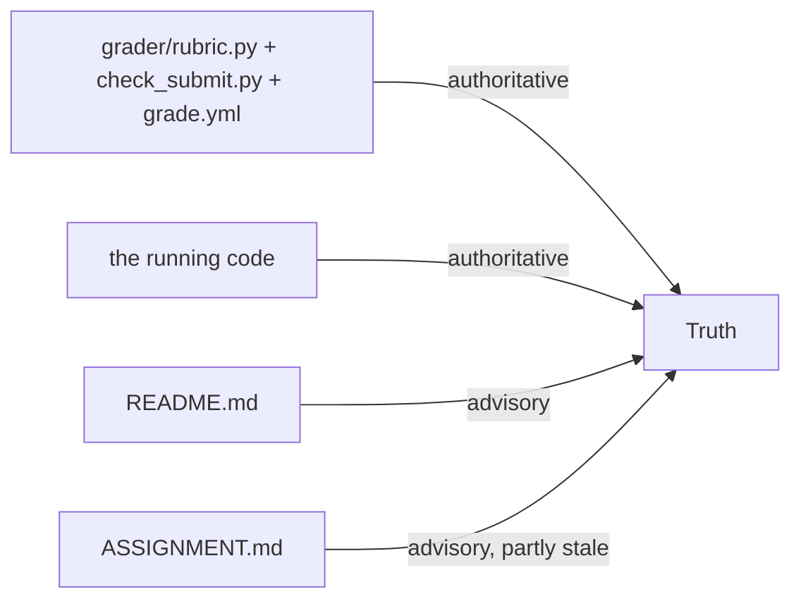
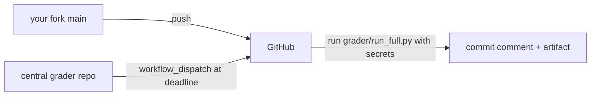

# Grading map + where the docs lie

Two things you need before submitting: (1) how points are *actually* awarded, and
(2) the places where ASSIGNMENT.md / README disagree with the code that runs.

---

## Authority order (important)

ASSIGNMENT.md claims it wins over the per-exercise READMEs. In practice the
**code and `grader/` win over both prose docs**, because the grader is what runs
at the deadline. When in doubt: `grader/rubric.py` + `grader/check_submit.py` +
`.github/workflows/grade.yml` are the source of truth.



---

## The three layers (100 pts)

| Layer | Weight | Scored by | Gist |
|---|---|---|---|
| Mechanical | 30 | local + CI | lint, format, files exist, tests pass with **0 skips**, integrity checks present |
| Behavioural | 40 | local (mock/offline) + CI (real) | each scenario runs end-to-end + its integrity check |
| Reasoning | 30 | **CI only** (LLM-as-judge) | Ex9 answers grounded in your sessions |

### Behavioural checks (exact, from `grader/rubric.py`) — 40 pts

| Check | Pts | Met now? |
|---|---|---|
| `ex5_scenario_runs_end_to_end` | 6 | ✅ (tools.py done) |
| `ex5_dataflow_catches_planted_fabrication` | 6 | ✅ |
| `ex5_dataflow_accepts_legitimate_flyer` | 3 | ✅ |
| `ex6_structured_half_accepts_valid_booking` | 4 | ✅ (mock) |
| `ex6_rejects_oversize_party` | 3 | ✅ (mock) |
| `ex6_rejects_high_deposit` | 3 | ✅ (mock) |
| `ex7_round_trip_completes` | 6 | ✅ |
| `ex7_no_multiple_handoff_files` | 2 | ✅ |
| `ex8_text_mode_at_least_3_turns` | 4 | needs `NEBIUS_KEY` to run |
| `ex8_trace_has_utterance_events` | 3 | needs `NEBIUS_KEY` to run |

### Mechanical checks (from `grader/check_submit.py`) — local view

`repo_has_required_top_level_files` (2) · `pyproject_pins_sovereign_agent_0_2_0`
(2) · `ruff_lint_clean` (3) · `ruff_format_clean` (2) · `pytest_collects` (3) ·
`public_tests_pass` **(5, requires 0 skips)** · `answers_files_exist` (2) ·
`answers_not_empty` (3) · `all_scenarios_have_integrity_check` **(5; missing →
−10 penalty)**.

> Public tests already report **27 passed, 0 skipped** after `tools.py` — the
> three previously-skipped tests are green.

### Reasoning (Ex9) — 30 pts, CI only

Cite real `sess_…` ids/trace lines (9), 100–400 words each (3), grounded not
generic (6), Q3 = exactly one primitive + one failure mode (2). See [ex9.md](ex9.md).

### Run it yourself

```bash
make check-submit            # local advisory grade (no reasoning, no private tests)
make test                    # 27 passed, 0 skipped
make ci                      # lint + format-check + test, in order
```

---

## Discrepancies between the docs and the code

### 1. Reference solutions are committed (an upstream leak)

`git diff 3ed7831..HEAD` shows the educator's "improving tools" commits added
full implementations into `integrity.py`, `validator.py`, `structured_half.py`,
`bridge.py`, `actions.py`, `voice_loop.py`, `manager_persona.py`, and pre-filled
`answers/ex9_reflection.md`. Only Ex5 `tools.py` was a genuine stub (now
completed). README says you "shouldn't" have solution access — you do.
**Implication:** for honest credit, the Ex9 reflection *must* be your own
(pre-filled examples score zero), and you should understand the code you're
submitting — which is what [the study guide](README.md) is for.

### 2. `flyer.md` vs `flyer.html`

ASSIGNMENT.md §Ex5 says the flyer is markdown written to `workspace/flyer.md`.
The code writes **HTML** to `workspace/flyer.html`
([tools.py](../../starter/edinburgh_research/tools.py),
[run.py:259](../../starter/edinburgh_research/run.py)) and `verify_dataflow`
parses HTML (`data-testid`, `<dd>£540</dd>`). **Code wins.**

### 3. ElevenLabs vs Rime (Ex8 TTS)

ASSIGNMENT.md §Ex8 names ElevenLabs. The code calls **Rime.ai Arcana**
([voice_loop.py:341-362](../../starter/voice_pipeline/voice_loop.py),
[pyproject.toml](../../pyproject.toml) voice extra). **Code wins** — key is
`RIME_API_KEY`.

### 4. Rasa flows: 3 required vs 1 shipped

ASSIGNMENT.md §Ex6 requires `confirm_booking`, `resume_from_loop`, and
`request_research`. The repo ships **only `confirm_booking`**, with a comment
explaining `resume_from_loop`/`request_research` were removed on purpose — the
reverse-handoff belongs in Ex7's Python bridge, not in Rasa
([flows.yml:20-33](../../rasa_project/data/flows.yml)). `grader/rubric.py` grades
only confirm/reject behaviour, not the removed flows. **Code wins.**

### 5. Ex9 citations vs git-ignored sessions

`answers/README.md` says the judge checks your `sessions/` artifacts, but
`sessions/` is in `.gitignore` and runners persist to the OS data dir. You must
copy cited sessions under `./sessions/` and `git add -f` them. See [ex9.md](ex9.md).

---

## Submission reality (you cloned upstream)

`origin` is `sovereignagents/homework-pub-booking` — you can't push there. CI
([.github/workflows/grade.yml](../../.github/workflows/grade.yml)) grades **your
fork's `main`** and posts a commit comment. To submit:

1. Fork on GitHub (or make a new private repo).
2. `git remote set-url origin <your-fork>` (or add a second remote).
3. Commit + push `main` — including `tools.py`, your Ex9 answers, the cited
   `sessions/` (force-added), and `uv.lock`. **Never** commit `.env`.
4. The deadline run is dispatched from a **central orchestration repo**, so the
   cohort also needs your fork URL on its roster — confirm that registration
   step in the cohort channel (it isn't visible in this repo).



Back to the [index](README.md).
